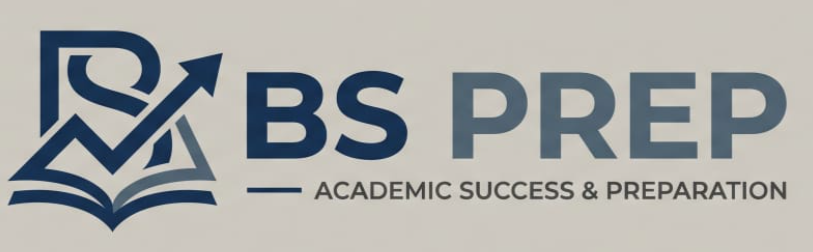

<p align="center">
  
</p>

<h1 align="center">BSPrep</h1>

<p align="center">
  Prep platform for IITM BS Degree students. Built by students.
</p>

<p align="center">
  <a href="https://bsprep.in" target="_blank" rel="noopener noreferrer"><b>bsprep.in</b></a>
</p>

<p align="center">
  
  
  
  
  
</p>

---


---

## What is BSPrep?

BSPrep is a learning platform built for students doing the IITM BS Degree. It is focused on the Qualifier level, which is the first real exam students have to clear before continuing in the program.

Everything on the platform is built around that one goal. The courses cover all 4 Qualifier subjects in Tamil. Mentors who have already cleared the Qualifier take live weekly sessions. There is an in-browser compiler, past quiz practice, GPA tools, and a community space for doubts.

This is not an official IIT Madras product. It is built and maintained by students.

## What we are trying to do

Most students who join the IITM BS program have no idea what the Qualifier actually demands. The syllabus is there, but there is no structured way to prepare for it, especially in Tamil. BSPrep exists to fix that.

The goal is to make sure no student fails the Qualifier just because they did not know how to prepare. Not because of language, not because they could not afford coaching, and not because they were doing it alone.

## Platform Features

| Feature | What it does |
|---|---|
| Video Courses | Full courses in Tamil for Math, Stats, Computational Thinking, and English |
| Live Classes | Weekly sessions per subject with mentors who have cleared the Qualifier |
| In-Browser Compiler | Write and run Python, Java, C, C++ without installing anything |
| Quiz Prep | Practice questions and past papers organized by topic |
| GPA Calculator | Calculate SGPA and see what your CGPA could look like |
| Leaderboard | See where you stand in the community |
| Mentorship | Connect with mentors for one-on-one guidance |
| Announcements | Stay updated on class schedules and platform news |
| Payments | Enroll in courses securely via Razorpay |
| Auth | Sign in with email or Google |

---

## Tech Stack

### Core

| Layer | Technology |
|---|---|
| Framework | Next.js 16 (App Router, Turbopack) |
| Language | TypeScript 5 |
| Styling | Tailwind CSS v4 |
| UI Components | shadcn/ui built on Radix UI |
| Animations | Framer Motion, GSAP |
| 3D / Canvas | Three.js, @react-three/fiber, @react-three/drei |
| Icons | Lucide React |

### Backend and Infrastructure

| Layer | Technology |
|---|---|
| API | Next.js API Routes (all keys server-side only) |
| Database | Supabase (PostgreSQL with Row Level Security) |
| Auth | Supabase Auth with email and Google OAuth |
| Payments | Razorpay with server-side order creation and webhook verification |
| Bot Protection | Cloudflare Turnstile |
| Deployment | Vercel |
| Analytics | Vercel Analytics, Google Analytics |
| Media CDN | Cloudinary for video hosting, Github cdn for Images |

### Editor and Compiler

| Tool | Purpose |
|---|---|
| Monaco Editor | In-browser code editor |
| CodeMirror 6 | Lightweight editor for embedded code |
| Pyodide | Python runtime in the browser via WebAssembly |
| Custom Judge API | Server-side execution for Java, C, C++ |

### Forms and Validation

| Tool | Purpose |
|---|---|
| React Hook Form | Form state |
| Zod | Schema validation |
| @hookform/resolvers | Connecting forms to Zod |

### UI and Utility Libraries

| Library | Purpose |
|---|---|
| Recharts | Charts for GPA and progress |
| Embla Carousel | Carousels and sliders |
| Sonner | Toast notifications |
| date-fns | Date formatting |
| driver.js | Onboarding tours |
| react-image-crop | Profile photo cropping |
| vaul | Drawer component |
| cmdk | Command palette |
| clsx and tailwind-merge | Class name utilities |
| class-variance-authority | Component variant system |

---

## Run Locally

```bash
git clone https://github.com/bsprep/bs-prep
cd bs-prep
npm install
npm run dev
```

Open [http://localhost:3000](http://localhost:3000).

You need a `.env.local` file with Supabase and Razorpay keys. Contact the team for dev credentials.

---

## Usage Restriction

This code is proprietary. All rights reserved.

You cannot copy, reuse, fork, redistribute, or deploy this codebase anywhere. You cannot use any part of it in personal, academic, or commercial projects. Any use beyond reading requires explicit written permission from the BSPrep team.

---

## Disclaimer

This is an independent student project. It is not affiliated with or endorsed by IIT Madras in any way.
